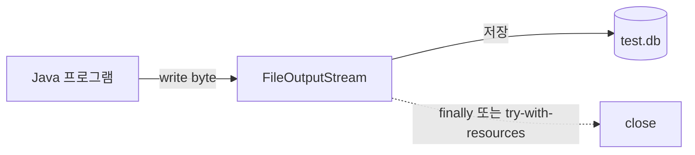
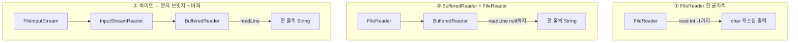
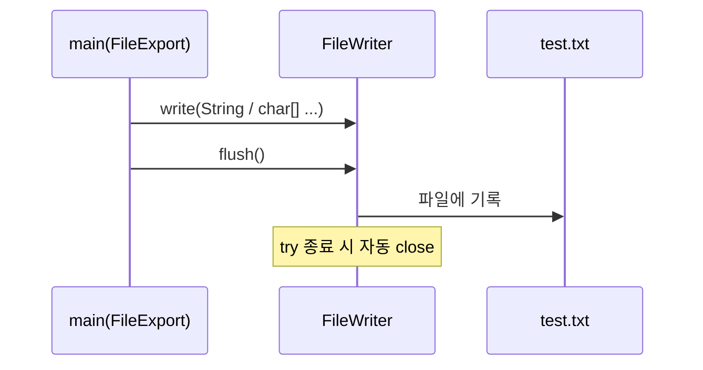
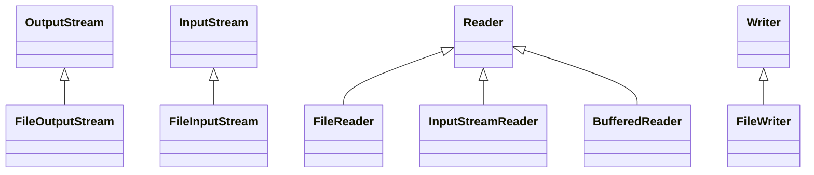

<br>


<br>

# ☕ Java Basic Learning - Day 13 (File I/O / Stream)

Day13은 **파일 입출력**과 **스트림(Stream)** 의 기본 흐름을 연습하는 프로젝트입니다.  
바이트 스트림(`FileOutputStream`), 문자 스트림(`FileReader` / `FileWriter`), **try-with-resources**, 그리고 **바이트→문자 브릿지(`InputStreamReader`) + `BufferedReader`** 조합까지 한 번에 정리합니다.

---

## 핵심 개념 한 장 요약

- **스트림**: 프로그램과 **외부 자원(파일, DB, 네트워크)** 사이의 **연결 통로**. 열면(`open`) 반드시 닫는(`close`) 습관이 중요합니다.
- **바이트 스트림**: 이미지·동영상·바이너리 등 **1바이트 단위**. 대표적으로 `InputStream` / `OutputStream`, 파일용 `FileInputStream` / `FileOutputStream`.
- **문자 스트림**: **문자(텍스트)** 처리에 특화. `Reader` / `Writer`, 파일용 `FileReader` / `FileWriter`.
- **예외 처리**: 파일·DB처럼 외부 자원은 **반드시 try-catch**(또는 throws)로 다룹니다.
- **try-with-resources**: `try (자원 선언) { }` 형태로 **close를 자동**으로 호출해 누수를 줄입니다.

---

## 스트림 종류 비교 표

| 구분 | 바이트 스트림 | 문자 스트림 |
|------|---------------|-------------|
| 기반 타입 | `InputStream` / `OutputStream` | `Reader` / `Writer` |
| 파일 연결 예 | `FileInputStream`, `FileOutputStream` | `FileReader`, `FileWriter` |
| 주 용도 | 바이너리, 네트워크 바이트 | 텍스트(문자) 읽기/쓰기 |
| 이 프로젝트 예제 | `WriteExample`, `WriteExample2` | `FileImport`, `FileExport` |

---

## `finally` 수동 close vs try-with-resources

| 방식 | 장점 | 주의 |
|------|------|------|
| `try { } catch { } finally { os.close(); }` | JDK 버전 제약이 적을 때 이해용으로 좋음 | `null` 체크, `close()`도 IOException 처리 필요 |
| `try (OutputStream os = ...) { }` | close 자동, 코드 짧음 | `AutoCloseable` 구현 자원만 사용 |

---

## 실행 흐름 그림 (mermaid)

### 1) 바이트 출력: 프로그램 → 파일



### 2) 문자 입력: 파일 → 프로그램 (세 가지 패턴)



### 3) 문자 출력: 프로그램 → 파일 (`FileWriter`)



---

## 코드 + 설명 (코드 아래에 바로 해설)

### `WriteExample.java` (바이트 출력 + `finally`에서 close)

```java
package file;

import java.io.FileNotFoundException;
import java.io.FileOutputStream;
import java.io.IOException;

public class WriteExample {
    public static void main(String[] args) {
        //1. 파일을 만들어서 내용을 넣고 싶음.
        //2. 이미지, 동영상, 문자 등 파일 --> Stream(바이트 스트림)
        //3. 출력 OutputStream --> FileOutputStream

        //2-1. 문자 파일 --> Reader, Writer(문자 스트림)
        //3-1. 출력 Writer --> FileWriter

        //파일을 만들어라.(파일 생성 + 자바프로그램과 파일간 연결통로를 만든다. 스트림 open)
        //파일에 내용을 쓰세요. write()
        //파일에 연결된 스트림 close()
        //외부 자원과 연결하는 경우 스트림open -- 스트림close
        //file, db server
        //예외처리 반드시 해주어야함. (try-catch)
        FileOutputStream os = null; //변수 선언시 반드시!! 초기값 넣어주어야함.
        try {
            os = new FileOutputStream("test.db");
            //타입명 변수명 --> 선언, 4바이트 공간 ram에 만든다.
            //선언시 주의점, 선언할 때 괄호 안에서만 사용 가능!!(scope)
            //괄호 밖에서는 인식 못함.
            //쓰는 방법, 1) byte단위, 2) byte배열, 3) byte배열(일부분)
            byte a = 10; //-128~127
            byte b = 20; //-128~127
            byte c = 30; //-128~127

            os.write(a);
            os.write(b);
            os.write(c);

        } catch (FileNotFoundException e) {
            System.out.println("파일이 없음.");
            //catch 여러개 쓸 때는 더 디테일한 예외처리부터 위에 써주세요.
        } catch (Exception e) {
            System.out.println("파일 출력시 에러 발생함. " + e.getMessage()); //간단하게 출력
            e.printStackTrace(); //자세하게 출력
        } finally {
            //에러가 발생하든 안하든 상관없이 무조건 실행하게 하고 싶은 경우
            try {
                os.close();
            } catch (IOException e) {
                System.out.println("파일 스트림 닫을 때 에러생김");
            }
        }
    }
}
```

- **핵심**: `FileOutputStream`으로 **바이트 3개(10, 20, 30)** 를 `test.db`에 씁니다.
- **핵심**: `catch`를 여러 개 둘 때는 **더 구체적인 예외**(`FileNotFoundException`)를 **위**에 둡니다.
- **주의**: `finally`에서 `close()`할 때 `os`가 `null`이면 `NullPointerException`이 날 수 있어, 실무에서는 `if (os != null)` 체크를 추가하는 편이 안전합니다.

---

### `WriteExample2.java` (try-with-resources + 다형성: `OutputStream`)

```java
package file;

import java.io.FileNotFoundException;
import java.io.FileOutputStream;
import java.io.IOException;
import java.io.OutputStream;

public class WriteExample2 {
    public static void main(String[] args) {
        //FileOutputStream만 넣을 수 있음. 결합도 100%
        //왼쪽 변수를 더 크게 해두면. 결합도 10%미만을 떨어짐.
        try (OutputStream os = new FileOutputStream("test.db")) {
            byte a = 10; //-128~127
            byte b = 20; //-128~127
            byte c = 30; //-128~127

            os.write(a);
            os.write(b);
            os.write(c);

        } catch (FileNotFoundException e) {
            System.out.println("파일이 없음.");
            //catch 여러개 쓸 때는 더 디테일한 예외처리부터 위에 써주세요.
        } catch (Exception e) {
            System.out.println("파일 출력시 에러 발생함. " + e.getMessage()); //간단하게 출력
            e.printStackTrace(); //자세하게 출력
        }
    }
}
```

- **핵심**: `try (OutputStream os = ...)` 는 블록 종료 시 **`close()` 자동 호출**이라 `finally`가 줄어듭니다.
- **핵심**: 왼쪽 타입을 `OutputStream`으로 두면 **구현체 교체**가 쉬워져 결합도를 낮추는 연습에 좋습니다.

---

### `FileExport.java` (문자 출력: `FileWriter`)

```java
package file;

import java.io.File;
import java.io.FileWriter;
import java.io.Writer;

public class FileExport {
    public static void main(String[] args) {
        //파일, db연결시 반드시!!!! 예외처리해주어야함.
        //try ~ catch ~ finally
        //try catch with resources(close 기능 내장)

        try (Writer writer = new FileWriter("test.txt")) { //파일생성 + 스트림open + close

            String s = "점심시간";
            writer.write(s + "\n");
            writer.write(s, 0, s.length()); //***제일 많이 씀.!
            writer.write("\n");

            writer.write("수요일", 0, 2);
            char[] chars = {'월', '화', '수'};
            writer.write(chars);
            writer.write("\n");
            writer.write(chars, 0, 2);

            writer.flush();
        } catch (Exception e) {
            System.out.println("파일 출력시 예외 발생 : " + e.getMessage());
        }
    }
}
```

- **핵심**: `Writer.write(String, off, len)` 형태는 **부분 문자열 쓰기**에 자주 쓰입니다.
- **핵심**: `flush()`는 버퍼에 남은 내용을 **즉시 파일로 밀어 넣을** 때 사용합니다(try 종료·close에서도 처리되는 경우가 많음).

---

### `FileImport.java` (문자 입력: 한 글자 / 한 줄 / 바이트→문자 브릿지)

```java
package file;

import java.io.*;

public class FileImport {
    public static void main(String[] args) {
        try(Reader reader = new FileReader("test.txt")) {
            while (true){
                int data = reader.read();
                //while 무한루프에는 반드시 끝나는 지점을 써주어야함.
                if (data == -1) {
                    System.out.println("읽기 종료");
                    //System.exit(0); //프로그램 종료
                    break; //반복문 종료하고 while문 아래있는 것 계속 실행
                }
                System.out.println((char)data);
            }
        } catch (Exception e) {
            System.out.println("에러발생");
        }

        //BufferReader를 이용해서 buffer(읽어온 데이터를 모으는 큰 공간)에 넣는 경우
        //Reader에서 읽어온 것만 넣을 수 있음.
        try (BufferedReader br = new BufferedReader(new FileReader("test.txt"))) {
            while (true){
                String s = br.readLine(); //buffer에 넣어야 한줄씩 읽어올 수 있음.
                if (s == null) {
                    break;
                }
                System.out.println("읽어온 문자열: " + s);
            }
        } catch (Exception e) {
            System.out.println("파일 한글자씩 읽어서 버퍼라는 큰 공간에 다 넣다가 에러");
        }

        //네트워크로 전송되는 데이터는 바이트스트림처리됨. --> Bufferdreader에 넣을 수 없음.
        //바이트스트림을 문자스트림으로 바꾸어서 Bufferdreader에 넣을 수 있음.
        //보조스트림(브릿지 스트림)
        try(
                //네트워크로 읽어온 바이트스트림
                FileInputStream stream = new FileInputStream("test.txt");
                //바이트스트림 --> 문자스트림
                InputStreamReader transfer = new InputStreamReader(stream);
                //문자스트림으로 버퍼에 넣음. --> 한줄씩 읽어올 수 있음.
                BufferedReader buffer = new BufferedReader(transfer);

                //BufferedReader buffer = new BufferedReader(new InputStreamReader(new FileInputStream("test.txt")))
        ){
            //읽는 처리 코드 들어감.
            while (true){
                String s = buffer.readLine(); //buffer에 넣어야 한줄씩 읽어올 수 있음.
                if (s == null) {
                    break;
                }
                System.out.println("읽어온 문자열: " + s);
            }
        } catch (Exception e) {
            System.out.println("바이트스트림으로 버퍼에 넣는 중 에러생김");
        }
    }
}
```

- **핵심**: `Reader.read()`는 **끝이면 -1**을 반환합니다. 무한 루프에서는 **반드시 종료 조건**을 넣습니다.
- **핵심**: `BufferedReader.readLine()`은 **줄 단위**로 읽고, 끝이면 `null`입니다.
- **핵심**: 네트워크 등 **바이트 스트림만** 있을 때는 `InputStreamReader`로 **문자 스트림으로 변환**한 뒤 `BufferedReader`에 연결할 수 있습니다.

---

## 파일 구조 개요 (ASCII)

```
day13-file/
├── src/file/
│   ├── WriteExample.java    # 바이트 쓰기 + finally close
│   ├── WriteExample2.java   # 바이트 쓰기 + try-with-resources
│   ├── FileExport.java      # 문자 쓰기 → test.txt
│   └── FileImport.java      # 문자/버퍼/브릿지 읽기 ← test.txt
├── test.txt                 # FileExport 실행 후 생성·갱신
└── test.db                  # WriteExample(2) 실행 후 바이트 3개 저장
```

---

## 어떻게 실행하나요?

### IntelliJ IDEA 기준

- `day13-file/src/file` 아래 클래스를 각각 실행합니다.
  - 바이트 출력: `WriteExample` → `test.db` 갱신
  - 바이트 출력(자동 close): `WriteExample2` → `test.db` 갱신
  - 문자 출력: `FileExport` → `test.txt` 생성
  - 문자 입력: `FileImport` → **`test.txt`가 있어야** 정상 동작(먼저 `FileExport` 실행 권장)

<br>
<hr>
<br>

## 참고 그림: 스트림 계층(개념 스케치)



<br>

